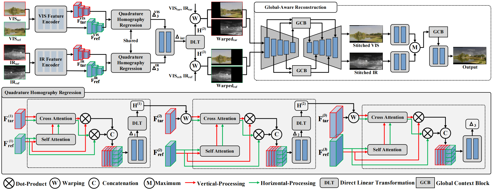

# Multi-Spectral Image Stitching via Global-Aware Quadrature Pyramid Regression


Zhiying Jiang, Zengxi Zhang, Jinyuan Liu, Xin Fan, Risheng Liu* ,**“Multi-Spectral Image Stitching via Global-Aware Quadrature Pyramid Regression”**, IEEE Transactions on Image Processing **(TIP)**, 2024. [*[paper]*](https://ieeexplore.ieee.org/document/10609325)
## Overview

## Updates

[2024-08-01] The testing code is available   
[2024-10-26] The training code in pytorch version is available

## Download

Download the pre-trained model and put it in 1_ImageAlignment_Pytorch/snapshot
  - [Google Drive](https://drive.google.com/file/d/1HpiEB2KvUKBvzX1n-TAHsh8U4sCQg1w3/view?usp=sharing)
  - [Baidu Yun](https://pan.baidu.com/s/1ucdeuGoL9pXyq-18nrcBKQ?pwd=ti0n)

Download the pre-trained model and put it in 2_ImageReconstruction_Pytorch/snapshot
  - [Google Drive](https://drive.google.com/file/d/1oPwDjY0-6HjTRFQ3jX8PFXFiXdYWt2ub/view?usp=sharing)
  - [Baidu Yun](https://pan.baidu.com/s/1ZP4hgBovXnsLHcOReCGnrg?pwd=ssfv)

(optional) Download the pre-trained model and put it in 2_Reconstruction_Tensorflow/snapshot
  - [Google Drive](https://drive.google.com/file/d/1ykjU9cxlnQUwSbFwE8sid3S6GS3K6Hjq/view?usp=sharing)
  - [Baidu Yun](https://pan.baidu.com/s/1NySeY6IeiuGCn5NLQbfiuA?pwd=w75q)

Download the pre-trained model and put it in 3_ImageFusion_Pytorch/snapshot
  - [Google Drive](https://drive.google.com/drive/folders/1hqzaneR__DnkzZexRxsPJ90dsv8OHfAh?usp=sharing)
  - [Baidu Yun](https://pan.baidu.com/s/19ORYNL7GCaBaWpTOX7Cwhg?pwd=g7ge)


## Requirements

```
Pytorch==1.12.1 Tensorflow==2.10.1
```

## Test
### Step 1: Generate aligned images
```
cd 1_ImageAlignment_Pytorch
python test.py
```
The generated images are used to the subsequent reconstruction.

### Step 2: Generate stitched images 
#### Tips: The original model was trained on tensorflow. For better use, we reproduced the whole model in Pytorch, but the image reconstruction effect deviated from the source code. Therefore, in addition to the pytorch version, we also open-sourced the source code for image reconstruction in Tensorflow. If you don't have tensorflow installed, you can also employ the Pytorch version in the experimental comparison.

### &emsp;Option 1: Generate stitched images on Pytorch
```
cd ../2_ImageReconstruction_Pytorch
python test.py
```
### &emsp;Option 2: Generate stitched images on Tensorflow
```
cd ../2_ImageReconstruction_Tensorflow
python test.py
```

### Step 3: Fuse stitched images 
```
cd ../3_ImageFusion_Pytorch
python test.py
```
## Train
### Step 1: Generate aligned images
```
cd 1_ImageAlignment_Pytorch
python train_H.py
```
### Step 2: Generate stitched images 
```
cd ../2_ImageReconstruction_Pytorch
python train.py
```
### Step 3: Fuse stitched images 
```
cd ../3_ImageFusion_Pytorch
python train.py
```
## Dataset (IVSD dataset)
  - [Google Drive](https://drive.google.com/file/d/1EFS0O-3KujvRJvcRx_Me5W2fdn9jRKGc/view?usp=sharing)
  - [Baidu Yun](https://pan.baidu.com/s/1ZP4hgBovXnsLHcOReCGnrg?pwd=ssfv)

## Citation
```
@ARTICLE{2024jianggqpr,
  author={Jiang, Zhiying and Zhang, Zengxi and Liu, Jinyuan and Fan, Xin and Liu, Risheng},
  journal={IEEE Transactions on Image Processing}, 
  title={Multispectral Image Stitching via Global-Aware Quadrature Pyramid Regression}, 
  year={2024},
  volume={},
  number={},
  pages={1-1},
  keywords={Image stitching;Estimation;Thermal sensors;Deformation;Optical sensors;Image reconstruction;Accuracy;Multi-Spectral image stitching;image fusion;infrared and visible images;pyramid structure;deep learning},
  doi={10.1109/TIP.2024.3430532}}
```
## Contact
If you have any question or suggestion, please email to [Zengxi Zhang](cyouzoukyuu@gmail.com) or [Zhiying Jiang](zyjiang0630@gmail.com).
